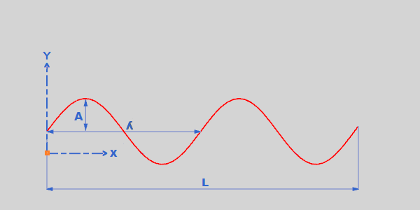

# sine_curve_generator_for_nx 

This code generates a sinus curve journal script for NX 11 software.

## How to use?

 - Run main.py
 - Enter values such as lambda, amptitude, Y axis offset, cycle number or total length.
 - Press Create
 - The journal file "macro_file.py" will be generated.
 - Open NX
 - Open Play Journal (Alt + F8)
 - Then press Run, Your curve will be created.

## Screenshot
